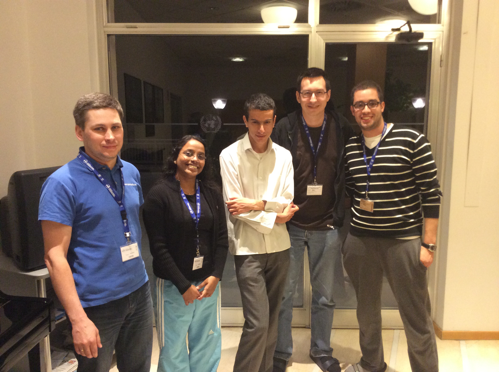

.. Funny Bike documentation master file, created by
   sphinx-quickstart on Thu Mar 20 16:10:34 2014.
   You can adapt this file completely to your liking, but it should at least
   contain the root `toctree` directive.

Welcome to Funny Bike's documentation!
======================================

In this documentation we report our implemetation of Funny Bikes using genetic algorithms. This project has been developed during ICTP workshop of Advanced Scientific Programming using Open Source packages by:

    
    (Alex, Prathyusha, Morteza, Richard, Ahmed)

    
This program consists of the following main classes:

.. toctree::
   :maxdepth: 2
   
   bike
   physics
   animate
   terrain
   bike_factory

Indices and tables
==================

* :ref:`genindex`
* :ref:`modindex`
* :ref:`search`

